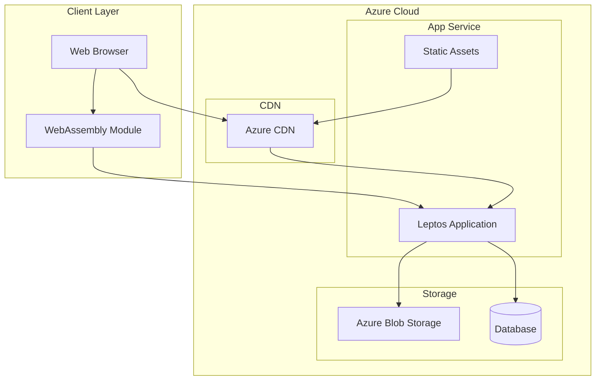
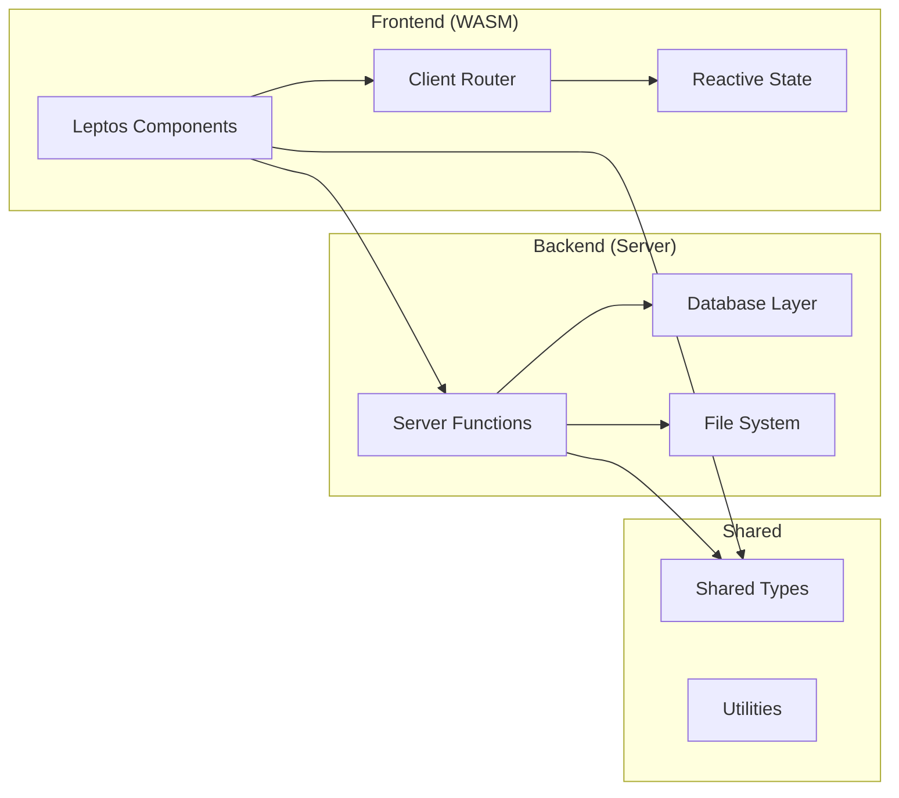
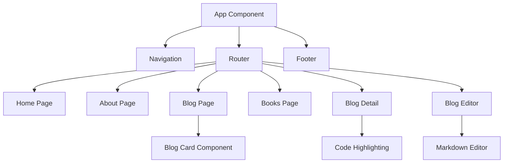

# Mike's Dev Blog

A modern, high-performance blog built with Rust and Leptos, showcasing software development insights, book recommendations, and technical articles.

## 🚀 Features

- **Server-Side Rendering (SSR)** with Leptos for optimal performance and SEO
- **WebAssembly (WASM)** for client-side interactivity
- **Responsive Design** with Tailwind CSS
- **Syntax Highlighting** with Prism.js for code blocks
- **Blog Management** with CRUD operations
- **Book Recommendations** curated collection
- **Modern Architecture** following clean code principles

## 🏗️ Architecture

### System Architecture



### Application Architecture



### Component Structure



## 🛠️ Tech Stack

### Core Technologies
- **[Rust](https://www.rust-lang.org/)** - Systems programming language
- **[Leptos](https://leptos.dev/)** - Full-stack web framework
- **[WebAssembly (WASM)](https://webassembly.org/)** - Client-side execution
- **[Tailwind CSS](https://tailwindcss.com/)** - Utility-first CSS framework

### Development Tools
- **[Trunk](https://trunkrs.dev/)** - WASM web application bundler
- **[Cargo](https://doc.rust-lang.org/cargo/)** - Rust package manager
- **[Prism.js](https://prismjs.com/)** - Syntax highlighting

### Azure Services
- **[Azure App Service](https://azure.microsoft.com/services/app-service/)** - Web application hosting
- **[Azure CDN](https://azure.microsoft.com/services/cdn/)** - Content delivery network
- **[Azure Blob Storage](https://azure.microsoft.com/services/storage/blobs/)** - Static asset storage

## 🚀 Getting Started

### Prerequisites

- [Rust](https://rustup.rs/) (latest stable version)
- [Trunk](https://trunkrs.dev/) for building WASM applications
- [Node.js](https://nodejs.org/) for Tailwind CSS processing

### Installation

1. **Clone the repository**
   ```bash
   git clone https://github.com/yourusername/mike-dev-blog.git
   cd mike-dev-blog
   ```

2. **Install Rust dependencies**
   ```bash
   cargo build
   ```

3. **Install Trunk**
   ```bash
   cargo install trunk
   ```

4. **Install Tailwind CSS (if using standalone)**
   ```bash
   npm install -D tailwindcss
   ```

### Development Setup

1. **Start the development server**
   ```bash
   trunk serve
   ```

2. **Open your browser**
   Navigate to `http://localhost:8080`

3. **Watch for changes**
   Trunk automatically rebuilds and hot-reloads on file changes

### Build for Production

```bash
# Build optimized WASM bundle
trunk build --release

# The dist/ folder contains the production build
```

## 📁 Project Structure

```
mike-dev-blog/
├── src/
│   ├── components/          # Reusable UI components
│   │   ├── blog_detail.rs   # Blog post detail view
│   │   ├── blog_editor.rs   # Blog post editor
│   │   ├── footer.rs        # Site footer
│   │   └── navigation.rs    # Navigation bar
│   ├── pages/               # Page components
│   │   ├── about.rs         # About page
│   │   ├── blog.rs          # Blog listing page
│   │   ├── book.rs          # Books page
│   │   └── home.rs          # Homepage
│   ├── server/              # Server-side functions
│   ├── app.rs               # Main app component
│   ├── lib.rs               # Library root
│   └── main.rs              # Application entry point
├── static/                  # Static assets
├── style/                   # CSS styles
├── Cargo.toml              # Rust dependencies
├── Trunk.toml              # Trunk configuration
├── tailwind.config.js      # Tailwind configuration
└── index.html              # HTML template
```

## 🔧 Configuration

### Environment Variables

Create a `.env` file for local development:

```env
LEPTOS_OUTPUT_NAME=mike-dev-blog
LEPTOS_SITE_ROOT=target/site
LEPTOS_SITE_PKG_DIR=pkg
LEPTOS_SITE_ADDR=127.0.0.1:3000
LEPTOS_RELOAD_PORT=3001
```

### Azure App Service Configuration

For deployment to Azure App Service, configure the following application settings:

```bash
# Azure CLI commands for configuration
az webapp config appsettings set \
  --resource-group myResourceGroup \
  --name myAppName \
  --settings LEPTOS_OUTPUT_NAME=mike-dev-blog

# Configure startup command
az webapp config set \
  --resource-group myResourceGroup \
  --name myAppName \
  --startup-file "./mike-dev-blog"
```

## 🚀 Deployment

### Azure App Service Deployment

#### Option 1: GitHub Actions (Recommended)

1. **Create deployment workflow** (`.github/workflows/deploy.yml`):

```yaml
name: Deploy to Azure App Service

on:
  push:
    branches: [ main ]

jobs:
  build-and-deploy:
    runs-on: ubuntu-latest
    
    steps:
    - uses: actions/checkout@v3
    
    - name: Setup Rust
      uses: actions-rs/toolchain@v1
      with:
        toolchain: stable
        target: wasm32-unknown-unknown
        
    - name: Install Trunk
      run: cargo install trunk
      
    - name: Build application
      run: trunk build --release
      
    - name: Deploy to Azure App Service
      uses: azure/webapps-deploy@v2
      with:
        app-name: 'your-app-name'
        publish-profile: ${{ secrets.AZURE_WEBAPP_PUBLISH_PROFILE }}
        package: ./dist
```

#### Option 2: Azure CLI Deployment

```bash
# Build the application
trunk build --release

# Deploy to Azure App Service
az webapp deployment source config-zip \
  --resource-group myResourceGroup \
  --name myAppName \
  --src dist.zip
```

#### Option 3: Docker Deployment

```dockerfile
# Dockerfile
FROM rust:1.70 as builder

WORKDIR /app
COPY . .

RUN cargo install trunk
RUN rustup target add wasm32-unknown-unknown
RUN trunk build --release

FROM nginx:alpine
COPY --from=builder /app/dist /usr/share/nginx/html
EXPOSE 80
CMD ["nginx", "-g", "daemon off;"]
```

### Performance Optimization

#### Azure-specific optimizations:

1. **Enable compression**
   ```bash
   az webapp config set \
     --resource-group myResourceGroup \
     --name myAppName \
     --generic-configurations '{"gzipCompression":"true"}'
   ```

2. **Configure caching headers**
   ```bash
   # Add web.config for static file caching
   ```

3. **Enable CDN**
   ```bash
   az cdn profile create \
     --resource-group myResourceGroup \
     --name myCDNProfile \
     --sku Standard_Microsoft
   ```

## 🧪 Testing

### Unit Tests
```bash
# Run all tests
cargo test

# Run tests with coverage
cargo test --all-features
```

### Integration Tests
```bash
# Run integration tests
cargo test --test integration
```

### End-to-End Tests
```bash
# Install testing dependencies
npm install -D @playwright/test

# Run E2E tests
npx playwright test
```

## 📊 Monitoring and Analytics

### Azure Application Insights Integration

```rust
// Add to your main.rs or app.rs
use leptos::*;

#[component]
pub fn App() -> impl IntoView {
    // Initialize Application Insights
    view! {
        <script>
            r#"
            !function(T,l,y){/* ApplicationInsights snippet */}
            "#
        </script>
        // ... rest of your app
    }
}
```

### Performance Monitoring

- **Azure Monitor** for application performance
- **Azure Log Analytics** for detailed logging
- **Custom metrics** for business intelligence

## 🔒 Security

### Security Best Practices

- **HTTPS Only** - Enforced through Azure App Service
- **Content Security Policy** - Implemented via HTTP headers
- **Input Validation** - Server-side validation for all user inputs
- **Authentication** - Azure AD integration for admin functions

### Azure Security Features

- **Azure Key Vault** for secrets management
- **Azure Security Center** for security monitoring
- **Web Application Firewall** for DDoS protection

## 📈 Performance

### Optimization Strategies

- **Code Splitting** - Lazy loading of route components
- **Asset Optimization** - Minimized CSS and JavaScript
- **Caching Strategy** - Browser and CDN caching
- **WASM Optimization** - Release builds with size optimization

### Performance Metrics

- **First Contentful Paint** < 1.5s
- **Largest Contentful Paint** < 2.5s
- **Cumulative Layout Shift** < 0.1
- **First Input Delay** < 100ms

## 🤝 Contributing

1. **Fork the repository**
2. **Create a feature branch** (`git checkout -b feature/amazing-feature`)
3. **Commit your changes** (`git commit -m 'Add amazing feature'`)
4. **Push to the branch** (`git push origin feature/amazing-feature`)
5. **Open a Pull Request**

### Development Guidelines

- Follow Rust coding conventions
- Write tests for new features
- Update documentation
- Ensure all tests pass
- Follow semantic versioning

## 📄 License

This project is licensed under the MIT License - see the [LICENSE](LICENSE) file for details.

## 🙏 Acknowledgments

- **Leptos Community** for the amazing framework
- **Rust Foundation** for the language
- **Azure Team** for excellent cloud services
- **Open Source Contributors** for various dependencies

## 📞 Support

For support and questions:

- **Issues**: [GitHub Issues](https://github.com/yourusername/mike-dev-blog/issues)
- **Discussions**: [GitHub Discussions](https://github.com/yourusername/mike-dev-blog/discussions)
- **Email**: contact@yourdomain.com

---

**Built with ❤️ using Rust and Leptos**